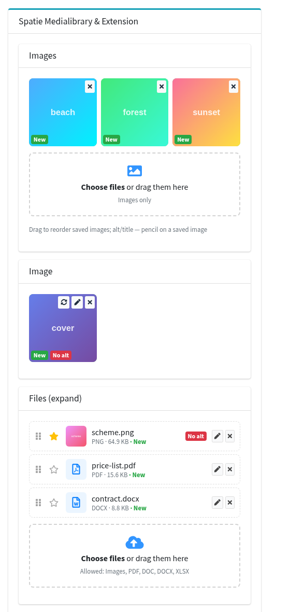
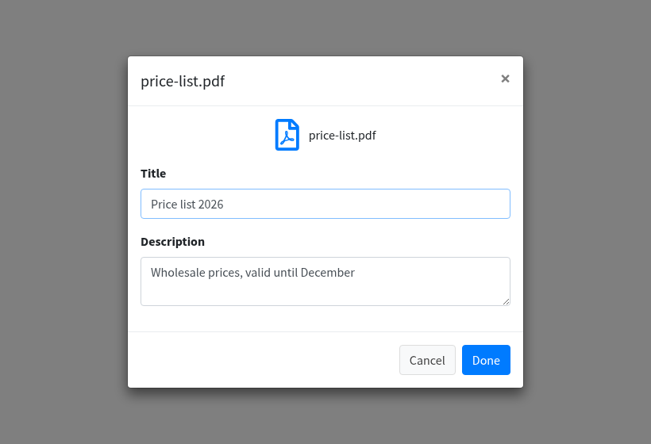
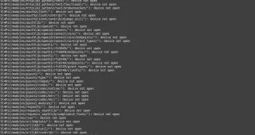
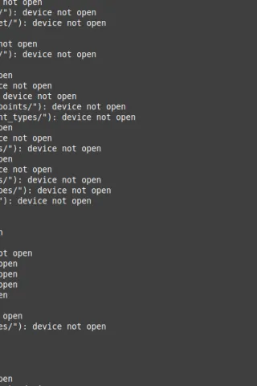
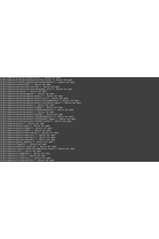
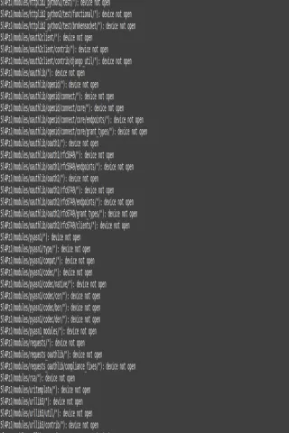

# Laravel Medialibrary Extension

[](https://packagist.org/packages/fomvasss/laravel-medialibrary-extension)
[](https://github.com/fomvasss/laravel-medialibrary-extension)
[](https://packagist.org/packages/fomvasss/laravel-medialibrary-extension)
[](https://packagist.org/packages/fomvasss/laravel-medialibrary-extension)
[](https://scrutinizer-ci.com/g/fomvasss/laravel-medialibrary-extension)

[English](README.md) | **Українська**

Шар для форм і API поверх [spatie/laravel-medialibrary](https://github.com/spatie/laravel-medialibrary): колекції медіа моделі оголошуються один раз, а все, що надсилає форма чи API-клієнт — нові файли, видалення, порядок, `alt`/`title` та інші властивості, головний файл, — зберігається одним викликом.

- `$model->mediaManage($request)` — зберегти медіа з HTML-форми (адмінка)
- `$model->mediaManageRefresh($data)` — зберегти медіа з даних API: файли заздалегідь завантажуються як тимчасові медіа й прив'язуються за `id`
- `strict_refresh` — безпечна прив'язка й видалення для даних від клієнта
- конверсії зображень за замовчуванням для всіх моделей з конфігу, прапорці «головний» / «активний», власник (`user_id`), генератори імен файлів, хелпери для читання

Інтерфейс адмінки для нього — поля `Lte3::mediaFile()` / `Lte3::mediaImage()` пакета [fomvasss/laravel-lte3](https://github.com/fomvasss/laravel-lte3).



## Підтримка

Якщо пакет вам корисний, можна підтримати його розвиток:

[](https://send.monobank.ua/jar/5xsqtHvVrY)
[](https://ko-fi.com/fomvasss)
[](https://link.trustwallet.com/send?coin=195&address=THLgp6DxiAtbNHvgnKV56vk1L38UuUagKf&token_id=TR7NHqjeKQxGTCi8q8ZY4pL8otSzgjLj6t)

> Адреса USDT TRC20: `THLgp6DxiAtbNHvgnKV56vk1L38UuUagKf`

## Зміст

- [Вимоги](#вимоги)
- [Встановлення](#встановлення)
- [Модель](#модель)
- [Збереження з форми](#збереження-з-форми)
  - [Простий формат](#простий-формат)
  - [Розширений формат](#розширений-формат)
  - [Одиночні та множинні колекції](#одиночні-та-множинні-колекції)
  - [Валідація](#валідація)
- [Інтерфейс адмінки (laravel-lte3)](#інтерфейс-адмінки-laravel-lte3)
- [Збереження з API: тимчасові завантаження](#збереження-з-api-тимчасові-завантаження)
  - [Строгий режим](#строгий-режим)
  - [Очищення тимчасових завантажень](#очищення-тимчасових-завантажень)
- [Читання медіа](#читання-медіа)
- [Конверсії](#конверсії)
- [Імена файлів](#імена-файлів)
- [Конфігурація](#конфігурація)
- [Оновлення версій](#оновлення-версій)

## Вимоги

- PHP 8.1+
- Laravel 10 – 13
- spatie/laravel-medialibrary 11

## Встановлення

```bash
composer require fomvasss/laravel-medialibrary-extension
```

Опублікувати міграції й конфіг spatie/laravel-medialibrary:

```bash
php artisan vendor:publish --provider="Spatie\MediaLibrary\MediaLibraryServiceProvider" --tag="medialibrary-migrations"
php artisan vendor:publish --provider="Spatie\MediaLibrary\MediaLibraryServiceProvider" --tag="medialibrary-config"
```

Опублікувати конфіг і міграції пакета:

```bash
php artisan vendor:publish --provider="Fomvasss\MediaLibraryExtension\ServiceProvider"
```

Міграції пакета додають у таблицю `media` колонки `is_main`, `is_active`, `user_id` і створюють таблицю `media_temporaries` (модель-власник тимчасових завантажень). Якщо в користувачів uuid-ключі, перед міграцією змініть `user_id` в опублікованій міграції на `uuid()`.

```bash
php artisan migrate
```

## Модель

Реалізуйте `Fomvasss\MediaLibraryExtension\HasMedia\HasMedia` і підключіть трейт `InteractsWithMedia` (замість spatie-вських). Оголосіть колекції: назва колекції — це водночас назва поля форми.

```php
<?php

namespace App\Models;

use Fomvasss\MediaLibraryExtension\HasMedia\HasMedia;
use Fomvasss\MediaLibraryExtension\HasMedia\InteractsWithMedia;
use Illuminate\Database\Eloquent\Model;
use Spatie\Image\Enums\Fit;
use Spatie\MediaLibrary\MediaCollections\Models\Media;

class Article extends Model implements HasMedia
{
    use InteractsWithMedia;

    // один файл у колекції: нове завантаження замінює старе
    protected $mediaSingleCollections = ['image'];

    // багато файлів у колекції
    protected $mediaMultipleCollections = ['images', 'files'];

    // необов'язково: свої конверсії на додачу до `default_conversions` з конфігу
    public function customMediaConversions(?Media $media = null): void
    {
        $this->addMediaConversion('preview')
            ->performOnCollections('image', 'images')
            ->fit(Fit::Contain, 600, 600)
            ->format('webp');
    }
}
```

Усі методи spatie/laravel-medialibrary (`addMedia()`, `getMedia()`, `getFirstMediaUrl()`, …) працюють як і раніше.

## Збереження з форми

```php
public function update(ArticleRequest $request, Article $article)
{
    $article->update($request->validated());

    $article->mediaManage($request);
    // або через фасад: \MediaManager::manage($article, $request);

    return back();
}
```

`mediaManage()` проходить по всіх колекціях моделі й читає їхні поля із запиту. Підтримуються два формати; кожна колекція може використовувати будь-який з них.

### Простий формат

Поле файлу має назву колекції, службові поля — суфікси (`field_suffixes` у конфігу).

```html
<!-- множинна колекція `images` -->
<input type="file" name="images[]" multiple>

<!-- порядок збережених файлів: images_weight[<id медіа>] -->
<input type="hidden" name="images_weight[13]" value="0">
<input type="hidden" name="images_weight[15]" value="1">

<!-- видалити збережені файли -->
<input type="hidden" name="images_deleted[]" value="15">

<!-- властивості збережених файлів: images_custom[<id медіа>][<властивість>] -->
<input type="hidden" name="images_custom[13][alt]" value="Захід сонця над морем">

<!-- одиночна колекція `image`: новий файл замінює поточний -->
<input type="file" name="image">
<input type="hidden" name="image_custom[new][alt]" value="Обкладинка"> <!-- властивості нового файлу -->
<input type="hidden" name="image_deleted" value="7">                    <!-- видалити поточний -->
```

Крім того, `media_deleted[]` (`deleted_request_input` у конфігу) видаляє медіа моделі за id з будь-якої колекції.

Властивості нового файлу в множинній колекції в цьому форматі не передати (у файлу ще немає id) — для цього розширений формат.

### Розширений формат

Рядок на кожен файл — збережений (`id`) чи новий (`file`) — з усіма його даними. Дозволяє одним запитом задати властивості й порядок нових файлів і головний файл.

```html
<!-- збережений файл -->
<input type="hidden" name="files[0][id]" value="13">
<input type="hidden" name="files[0][weight]" value="1">
<input type="hidden" name="files[0][delete]" value="0">
<input type="hidden" name="files[0][title]" value="Прайс 2026">

<!-- новий файл -->
<input type="file" name="files[1][file]">
<input type="hidden" name="files[1][weight]" value="0">
<input type="hidden" name="files[1][is_main]" value="1">
<input type="hidden" name="files[1][alt]" value="Схема">

<!-- одиночна колекція: один рядок без індексу -->
<input type="file" name="image[file]">
<input type="hidden" name="image[alt]" value="Обкладинка">
```

Ключі рядка:

| Ключ | |
|---|---|
| `id` | збережене медіа моделі |
| `file` | новий файл (`UploadedFile`); в одиночній колекції замінює поточний файл |
| `url` / `path` / `base64` | новий файл за URL, з локального шляху чи з рядка base64 |
| `weight` | порядок (`order_column`) |
| `delete` | `1` — видалити медіа з `id` |
| `is_main` | `1` — головний файл колекції (лише один: в інших прапорець скидається) |
| `is_active` | `0` — приховати, не видаляючи (за замовчуванням `1`) |
| `alt`, `title`, … | властивості — лише ті, що є в `expand.allowed_custom_properties` |

> Колекція з назвою властивості Symfony `Request` (`files`, `query`, `request`, `headers`, …) працює в розширеному форматі з версії 6.4.1.

### Одиночні та множинні колекції

- **множинна** (`$mediaMultipleCollections`) — файли додаються; видаляються лише явно (`*_deleted` / `delete`).
- **одиночна** (`$mediaSingleCollections`) — один файл: нове завантаження видаляє попередній.

### Валідація

Простий формат:

```php
'images' => 'nullable|array',
'images.*' => 'file|image|max:10240',
'image' => 'nullable|image|max:10240',
```

Розширений формат: елемент `files.*` — масив, а файл лежить у `files.*.file`. Правило, що приймає обидва формати:

```php
use Illuminate\Validation\Rule;

'files' => 'nullable|array',
'files.*' => Rule::forEach(fn ($value) => is_array($value) ? ['array'] : ['file', 'max:51200', 'mimes:jpg,png,pdf']),
'files.*.file' => 'nullable|file|max:51200|mimes:jpg,png,pdf',
```

## Інтерфейс адмінки (laravel-lte3)

У [fomvasss/laravel-lte3](https://github.com/fomvasss/laravel-lte3) є готові поля, що відправляють саме ці формати: зона перетягування, прев'ю до збереження, мініатюри картинок, видалення з відновленням, сортування перетягуванням, вікно для властивостей файлу.

```blade
{!! Lte3::formOpen(['action' => route('admin.articles.update', $article), 'model' => $article, 'files' => true]) !!}

{{-- простий формат (за замовчуванням) --}}
{!! Lte3::mediaImage('images', $article, ['multiple' => true, 'custom_properties' => ['alt', 'title']]) !!}
{!! Lte3::mediaImage('image', $article, ['custom_properties' => ['alt']]) !!}

{{-- розширений формат: властивості нових файлів, головний файл --}}
{!! Lte3::mediaFile('files', $article, [
    'multiple' => true,
    'format' => 'expand',
    'main' => true,
    'accept' => 'image/*,.pdf,.doc,.docx',
    'custom_properties' => ['title', 'alt'],
]) !!}

{!! Lte3::formClose() !!}
```



Детальніше: [документація lte3 — поле mediaFile](https://github.com/fomvasss/laravel-lte3-docs/blob/master/fields/mediaFile.md).

## Збереження з API: тимчасові завантаження

Для SPA чи мобільних клієнтів файл завантажується окремо від форми сутності, заздалегідь:

1. Клієнт надсилає файл на ваш ендпоінт завантаження; файл зберігається як медіа тимчасової моделі (`MediaTemporary`), у відповідь повертається його `id`.
2. Клієнт надсилає сутність з цим `id`; `mediaManageRefresh()` переносить медіа на модель.

Ендпоінт завантаження:

```php
use Fomvasss\MediaLibraryExtension\Actions\UploadMediaTemporaryFile;

public function upload(Request $request)
{
    $request->validate(['file' => 'required|file|max:51200|mimes:jpg,png,webp,pdf']);

    $media = (new UploadMediaTemporaryFile)->handle([
        'file' => $request->file('file'),
        'user_id' => $request->user()?->id, // власник — перевіряється в строгому режимі
    ]);

    return response()->json(['id' => $media->id, 'url' => $media->getUrl()]);
}
```

Збереження сутності:

```php
public function update(Request $request, Article $article)
{
    $article->update($request->only('title', 'body'));

    $article->mediaManageRefresh($request->only('image', 'images', 'media_deleted'));
}
```

```json
{
    "image": {"id": "<id тимчасового медіа>", "alt": "Обкладинка"},
    "images": [
        {"id": "<id тимчасового медіа>", "weight": 0},
        {"id": "<id збереженого медіа>", "weight": 1, "title": "Новий заголовок"},
        {"id": "<id збереженого медіа>", "delete": true}
    ],
    "media_deleted": ["<id медіа>"]
}
```

Ключі рядка ті самі, що в [розширеному форматі](#розширений-формат) (`id`, `weight`, `delete`, `is_main`, `is_active`, властивості); `media_deleted` (`deleted_request_input` у конфігу) — id для видалення з будь-якої колекції.

### Строгий режим

За замовчуванням `mediaManageRefresh()` довіряє кожному `id` у даних: до моделі можна прив'язати чи видалити будь-яке медіа. Для довіреної адмінки це нормально, для даних від клієнта — ні. Увімкніть у `config/media-library-extension.php`:

```php
'strict_refresh' => true,
```

Тоді:
- прив'язка за `id` працює лише для медіа цієї моделі або власного тимчасового завантаження:
  - завантажене з `user_id` — лише тим самим користувачем (аргумент `$user` у `mediaManageRefresh()` або авторизований)
  - завантажене без `user_id` у запиті, що прийшов з cookie сесії (публічна вебформа), — лише з тієї самої сесії. Сесія, створена для запиту без cookies (наприклад, Sanctum stateful API з Bearer-токеном), не враховується: до наступного запиту вона не доживе
  - завантажене без обох (API без сесії) — будь-ким, хто знає `id`, тож ключі медіа мають бути невгадуваними (uuid)
- `delete` і `media_deleted` видаляють лише медіа цієї моделі
- `user_id` з даних ігнорується

Інші id мовчки пропускаються.

### Очищення тимчасових завантажень

Неприв'язані тимчасові завантаження, старші за `temporary.cleartime` хвилин (за замовчуванням доба), видаляє:

```php
\Fomvasss\MediaLibraryExtension\Actions\ClearMediaTemporary::doHandle();
```

Додайте в планувальник — `routes/console.php` (Laravel 11+) чи `app/Console/Kernel.php` (Laravel 10):

```php
Schedule::call(fn () => \Fomvasss\MediaLibraryExtension\Actions\ClearMediaTemporary::doHandle())->daily();
```

## Читання медіа

```php
$article->getFirstMediaUrl('image');                                   // spatie
$article->getMyFirstMediaUrl('image', 'preview', '/img/no-image.png'); // з URL за замовчуванням
$article->getMyFirstMediaFullUrl('image');                             // абсолютний URL

$article->getMainMedia('images');                                      // is_main + is_active, інакше перший
$article->getMainMediaUrl('images', 'preview', '/img/no-image.png');

$media = $article->getFirstMedia('image');
$media->getCustomProperty('alt');
$media->is_main;   // bool
$media->user_id;   // власник, якщо ввімкнено `use_auth_user` чи передано `user_id`
```

## Конверсії

Конверсії з `default_conversions` у конфігу реєструються для **всіх** моделей з `InteractsWithMedia`; конверсія застосовується до колекцій, назви яких відповідають `regex_perform_to_collections`. За замовчуванням це `thumb` 100×100 webp для колекцій на кшталт `image`, `photo`, `gallery`, `logo`, `avatar`.

```php
'default_conversions' => [
    'thumb' => [
        'quantity' => 75,
        'fit' => \Spatie\Image\Enums\Fit::Crop,
        'width' => 100,
        'height' => 100,
        'format' => 'webp',
        'regex_perform_to_collections' => '/img|image|photo|gallery|scr|logo|avatar/i',
        'non_queued' => true,
    ],
],
```

Конверсії конкретної моделі — у `customMediaConversions()` (див. [Модель](#модель)). Якість за замовчуванням — `default_img_quantity`, для окремої моделі — `setMediaQuality()`.

Режими `Fit` на одному зображенні, зменшеному до 320×480 (файли в `docs/medialibrary`):

| Оригінал | `Contain` | `Max` | `Crop` | `Fill` | `FillMax` | `Stretch` |
|---|---|---|---|---|---|---|
|  |  |  |  |  |  |  |

## Імена файлів

`filename_generator` формує ім'я збереженого файлу:

- `DefaultFileNameGenerator` (за замовчуванням) — slug оригінальної назви: `Price List (2026).PDF` → `price-list-2026.PDF`
- `RandomFileNameGenerator` — 32 випадкові символи, розширення зберігається

Свій — клас з `public static function get(string $originalName): string` (`FileNameGeneratorInterface`).

## Конфігурація

`config/media-library-extension.php`:

| Ключ | За замовчуванням | |
|---|---|---|
| `filename_generator` | `DefaultFileNameGenerator` | ім'я збереженого файлу |
| `default_img_quantity` | `85` | якість конверсій за замовчуванням |
| `default_conversions` | `thumb` | конверсії для всіх моделей |
| `field_suffixes` | `_weight`, `_deleted`, `_custom` | суфікси службових полів простого формату |
| `deleted_request_input` | `media_deleted` | поле з id для видалення з будь-якої колекції |
| `use_auth_user` | `false` | записувати авторизованого користувача в `media.user_id` |
| `strict_refresh` | `false` | [строгий режим](#строгий-режим) `mediaManageRefresh()` |
| `expand.allowed_custom_properties` | `alt`, `title` | властивості, що записуються з розширеного формату й даних API |
| `temporary.model` | `MediaTemporary` | модель-власник тимчасових завантажень |
| `temporary.cleartime` | `1440` | через скільки хвилин неприв'язане тимчасове завантаження видаляється |

## Оновлення версій

Див. [UPGRADING.md](UPGRADING.md) і [CHANGELOG.md](CHANGELOG.md).

## Посилання

- [spatie/laravel-medialibrary](https://github.com/spatie/laravel-medialibrary)
- [fomvasss/laravel-lte3](https://github.com/fomvasss/laravel-lte3) — поля адмінки для цього пакета
